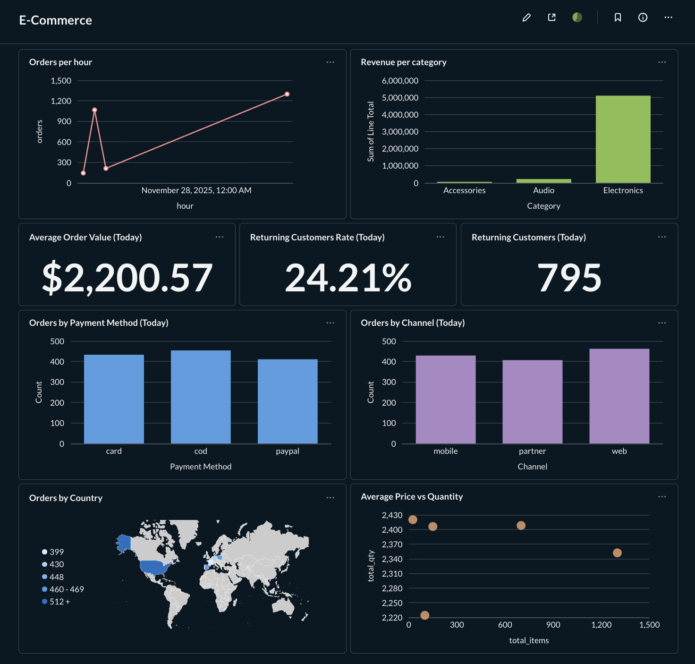

📊 Real-Time Ecommerce Pipeline

Kafka • Spark Structured Streaming • PostgreSQL • Metabase

Real-time data engineering project processing e-commerce orders end-to-end:
data generation → Kafka → Spark streaming transformations → PostgreSQL → analytics dashboard in Metabase.

⸻

🚀 Architecture Overview
```text
+------------------+        +-----------------+        +------------------+
|  Generator (Py)  |  -->   |     Kafka       |  -->   |   Spark Streaming|
+------------------+        +-----------------+        +------------------+
                                                             |
                                                             v
                                                    +------------------+
                                                    |   PostgreSQL     |
                                                    +------------------+
                                                             |
                                                             v
                                                    +------------------+
                                                    |    Metabase      |
                                                    +------------------+
```

⸻

🧰 Tech Stack
	•	Python (order generator, Kafka producer)
	•	Apache Kafka
	•	Spark Structured Streaming
	•	PostgreSQL
	•	Metabase
	•	Docker Compose

⸻

📦 Project Structure

```text 
realtime-ecommerce-pipeline/
│
├── generator/          # Kafka producer generating fake orders
├── spark/              # Spark Structured Streaming job
├── database/           # PostgreSQL init sql, docker config
├── dashboard/          # Metabase docker-compose.yml
├── README.md
└── ...

```


⸻

🔧 How to Run Locally

1️⃣ Start Kafka, Zookeeper, and PostgreSQL

``bash
docker compose -f docker-compose.yml up -d
```
2️⃣ Start the order generator

```bash
cd generator
python generate_orders.py
```
3️⃣ Start Spark streaming job

```bash
cd spark
python stream_orders.py
```

4️⃣ Run Metabase

```bash
cd dashboard
docker compose up -d
```
Access Metabase at:
http://localhost:3000


⸻
📈 Dashboard (Screenshots)

Metabase runs locally in one command, but screenshots are provided.



⸻
🔥 Features

✔ Real-time ingestion using Kafka
✔ Nested JSON schema (customer + items)
✔ Flattening & exploding arrays in Spark
✔ Writing to PostgreSQL with UPSERT logic
✔ Real-time analytics dashboard in Metabase
✔ Fully reproducible setup with Docker

⸻

📬 Notes.

This project demonstrates:
	•	Real-time streaming architecture
	•	Handling nested JSON data
	•	OLTP → OLAP pipeline
	•	Dashboard creation
	•	Production-style Spark & SQL logic
	•	Deduplication and UPSERT handling

Everything runs locally in ~3 minutes.

⸻

👤 Author

Michał Lipa
